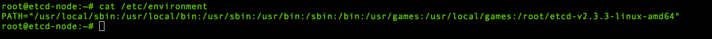
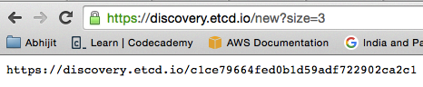
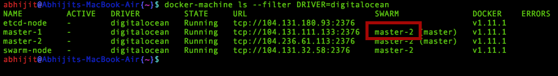
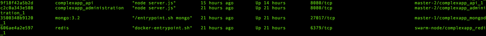
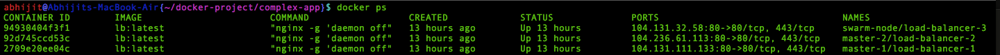
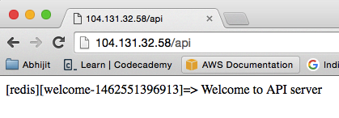
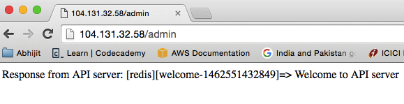
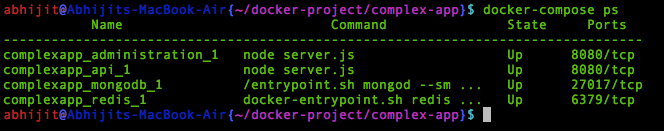
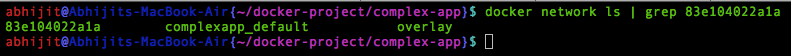

##High Available Docker Swarm cluster with ETCD  cluster using Docker machine and Docker Compose 

  ####Tested with Mac OS 10.10.3 (Yosemite)

###Dependency

 * [Docker-machine](https://docs.docker.com/engine/installation/mac/) >= 0.7.0
 * [Docker-client](https://docs.docker.com/engine/installation/mac/)  >= 1.11.1
 * [Docker-compose](https://docs.docker.com/compose/install/)         >= 1.7.0
 * Digital Ocean credentials 

###A  key-value store 

Docker compose version 2  requires a overlay network to communicate among dokcer container on different host.
An overlay network requires a key-value store. The key-value store holds information about the network state which includes discovery, networks, endpoints, IP addresses, and more.

Here we are going to use [ETCD](https://github.com/coreos/etcd/) as key-value store.

* Provison a VM on cloud with name **etcd-node** execute the follwing cmd from your laptop.

<pre>
	docker-machine create --driver digitalocean --digitalocean-access-token=&lt;Your_Token&gt; etcd-node
</pre>

* Login to the VM created earlier.

<pre>
	docker-machine ssh etcd-node
</pre>

* Download the latest stable etcd package from [here](https://github.com/coreos/etcd/releases)

<pre>
	curl -L  https://github.com/coreos/etcd/releases/download/v2.3.3/etcd-v2.3.3-linux-amd64.tar.gz -o etcd-v2.3.3-linux-amd64.tar.gz
	tar xzvf etcd-v2.3.3-linux-amd64.tar.gz
</pre>

* Make etcd executables available in Linux Path 

	* To make the changes to PATH persists set the PATH in **/etc/environment** 

	

    * To make chanages to PATH on linux CLI. 

	<pre>
		export PATH="/usr/local/sbin:/usr/local/bin:/usr/sbin:/usr/bin:/sbin:/bin:/usr/games:/usr/local/games:/root/etcd-v2.3.3-linux-amd64"
	</pre>

* Here we are going to run three etcd instances on the same Host with different ports.

   * 500x for clinet 
   * 800x for peers 

* And to bootstrap the etcd cluster we will use the discovery URL 

  To generate a discovery URL  with cluster size 3 

   * On Linux CLI

   <pre>
   		curl -w "\n" 'https://discovery.etcd.io/new?size=3'
   	</pre>

   * Using web browser 

   

  Copy the discovery URL.

* Set the followiing varible for discovery URL and etcd_node IP

<pre>
	discovery_URL=discovery_URL_copied_earlier
	etcd_node_IP=$(dig @resolver1.opendns.com myip.opendns.com +short)
</pre>

* Execute the following command with your discovery URL to start the etcd instances.

<pre> 
   nohup etcd --name etcd1 --listen-client-urls http://0.0.0.0:5001 --advertise-client-urls http://${etcd_node_IP}:5001 --listen-peer-urls http://0.0.0.0:8001 --initial-advertise-peer-urls http://${etcd_node_IP}:8001 --discovery $discovery_URL >>  /dev/null 2>&1 & 

   nohup etcd --name etcd2 --listen-client-urls http://0.0.0.0:5002 --advertise-client-urls http://${etcd_node_IP}:5002 --listen-peer-urls http://0.0.0.0:8002 --initial-advertise-peer-urls http://${etcd_node_IP}:8002 --discovery $discovery_URL >>  /dev/null 2>&1 & 

   nohup etcd --name etcd3 --listen-client-urls http://0.0.0.0:5003 --advertise-client-urls http://${etcd_node_IP}:5003 --listen-peer-urls http://0.0.0.0:8003 --initial-advertise-peer-urls http://${etcd_node_IP}:8003 --discovery $discovery_URL >>  /dev/null 2>&1 &
</pre>

Etcd cluster has been created, to view the whether the cluster has been boostraped hit the discovery URL in your web browser.
It should show all the etcd instances.

###Create a HA Swarm cluster

* To create the Swarm **swarm-master-1** execute the follwing cmd from your laptop 

<pre>
	etcd_node_IP=$(docker-machine ip etcd-node)
	docker-machine create --driver digitalocean --digitalocean-access-token=&lt;Your_Token&gt; --swarm --swarm-master --swarm-opt replication  --swarm-discovery="etcd://${etcd_node_IP}:5001,${etcd_node_IP}:5002,${etcd_node_IP}:5003" --engine-opt="cluster-store=etcd://${etcd_node_IP}:5001,${etcd_node_IP}:5002,${etcd_node_IP}:5003" --engine-opt="cluster-advertise=eth0:2376" swarm-master-1
</pre>

* To create the Swarm **swarm-master-replica** execute the follwing cmd from your laptop

<pre>
	etcd_node_IP=$(docker-machine ip etcd-node)
	docker-machine create --driver digitalocean --digitalocean-access-token=&lt;Your_Token&gt; --swarm --swarm-master --swarm-opt replication  --swarm-discovery="etcd://${etcd_node_IP}:5001,${etcd_node_IP}:5002,${etcd_node_IP}:5003" --engine-opt="cluster-store=etcd://${etcd_node_IP}:5001,${etcd_node_IP}:5002,${etcd_node_IP}:5003" --engine-opt="cluster-advertise=eth0:2376" swarm-master-replica
</pre>

* To create Swarm **swarm-node-1**  execute the follwing cmd from your laptop

<pre>
	etcd_node_IP=$(docker-machine ip etcd-node)
	docker-machine create --driver digitalocean --digitalocean-access-token=&lt;Your_Token&gt; --swarm   --swarm-discovery="etcd://${etcd_node_IP}:5001,${etcd_node_IP}:5002,${etcd_node_IP}:5003" --engine-opt="cluster-store=etcd://${etcd_node_IP}:5001,${etcd_node_IP}:5002,${etcd_node_IP}:5003" --engine-opt="cluster-advertise=eth0:2376" swarm-node-1
</pre>

  Now the Swarm cluster has been created. To view the cluster status and get the current primary of cluster.

<pre>
	eval $(docker-machine env --swarm swarm-master-1)
	docker info 
</pre>

It should show something like this. ( Note the node names are different here in the screenshot )

For this case your nodes will be 

  * swarm-master-1 ( equivalent to  master-1 in sceenshot)
  * swarm-master-replica ( equivalent to  master-2 in sceenshot)
  * swarm-node-1 ( equivalent to  swarm-node in sceenshot)

We will require to get the swarm cluster name. 

For this case the swarm cluster name will be 

  * swarm-master-replica ( equivalent to  master-2 in sceenshot)

###Docker compose to bring your stack up on the swarm cluster 

Now that our swarm cluster is up, we can deploy our stack on it using docker compose 

Change the present working directoy to the directory in  which **docker-compose.yml** is present.

For me it is **~/docker-project/complex-app**

To make the existing docker-compose file work with version 2, some changes has been made.

<pre>
	##Change the pwd to your docker-compose.yml  directoy.
	cd ~/docker-project/complex-app

	##Build images required for docker-compose on each swarm cluster member
	eval $(docker-machine env  swarm-master-1)
	docker-compose build 
	eval $(docker-machine env  swarm-master-replica)
	docker-compose build
	eval $(docker-machine env swarm-node-1)
	docker-compose build

	##Change env to docker swarm primary 
	eval $(docker-machine env --swarm swarm-master-1)

	##Run deploy the stack 
	docker-compose up -d 
</pre>

Once the above command is done executing, you can view the containers. 

<pre> 
	docker ps 
</pre>

It will show something like this 

###HA Load Balancing for api and admin containers using nginx. 

To perform load balancing for api and admin server, we will launch the nginx container on each swarm cluster member. 
Each nginx load-balancer container will point to the all the existing api and admin container and will bind a host port ( currently 80 ) to listen to api and admin calls.

To create the load-balancer on each swarm cluster member, excute the following script first argument as swarm cluster name ( In this case it will be **swarm-master-replica**) and second argument as swarm primary name ( in this case it will **swarm-master-1**)

<pre>
	./load-balancer.sh "swarm-master-replica" "swarm-master-1"
</pre>

This will set up the load balancer, to access the api and admin server.

look for the any ip address of swarm member 

To get the exact IPS 

Hit the load balancer endpoint in your web browser to test if it is working.

###Scale the container.

To scale the no of containers for any service 

docker-compose scale &lt;service_name&gt;=&lt;count&gt;

<pre>
	##Change env to docker swarm primary 
	eval $(docker-machine env --swarm swarm-master-1)
	docker-compose scale api=2
</pre>

Once the scaling is done, wait for sometime until the container is up and has the entry in overlay network.

To test if the container is registered with network 

<pre> 
	docker network inspect    complexapp_default
</pre>

onec the o/p of above cmd shows the entry of new container, execute the **load-balancer.sh** script to reflect those changes. 

###Blue-Green deployment 

To apply blue-green deployment using the docker-compose, following  things required.

  * Change the Present working directoy name / change the Present working directoy
  * Copy the **nginx** folder to the new Present working directoy.

Docker compose will launch the all the service in your docker-compose.yml file with the **prefix** as the present working directory name

E.g.

If the present working directoy is **~/docker-project/complex-app** then all the service containers will have prefix like **complexapp** along with the node name.

At the same time docker compose will create a new overlay  network for the app of not created already. The name of that name will have
present wokring directory name as prefix.

E.g.
	
If the present working directoy is **~/docker-project/complex-app** , then newtork name will be **complexapp_default**.

Using the above behavior, we can use either different directory altogether to launch the new version or we can chagne the name of current working directoy and then copy our new docker-compose.yml file to it.

If you are going to use a altogther different directory, please copy the **nginx** folder to new docker-compose.yml directory.

Once the above steps are done, you will have a 

  * New/name changed present working directory with your new docker-compose.yml and nginx folder in it.

To create the new version 

<pre>
	docker-compose up -d 

</pre>

This will launch the new version of your app on a different network than your old app, but right now this new version app will get actual traffic until you make the changes to load balancers.

To route the actual traffic to the new version,load balancers must on 
 
 * The same network as the app
 * It should point to the correct IPs of app and admin server 

To do that you, just have run the **load-balancer.sh** script. { Note before running the script make sure the parameters inside the script are correclty set}

<pre>
	nginx/load-balancer.sh
</pre>

	

