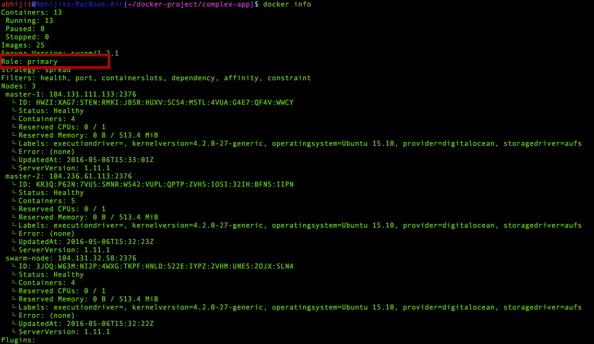

##High Available Docker Swarm cluster with ETCD  cluster using Docker machine and Docker Compose 

  ####Tested with Mac OS 10.10.3 (Yosemite)

###Dependency

 * [Docker-machine](https://docs.docker.com/engine/installation/mac/) >= 0.7.0
 * [Docker-client](https://docs.docker.com/engine/installation/mac/)  >= 1.11.1
 * [Docker-compose](https://docs.docker.com/compose/install/)         >= 1.7.0
 * Digital Ocean credentials 

###A  key-value store 

Docker compose version 2  requires a overlay network to communicate among dokcer container on different host.
An overlay network requires a key-value store. The key-value store holds information about the network state which includes discovery, networks, endpoints, IP addresses, and more.

Here we are going to use [ETCD](https://github.com/coreos/etcd/) as key-value store.

* Provison a VM on cloud with name **etcd-node** execute the follwing cmd from your laptop.

<pre>
	docker-machine create --driver digitalocean --digitalocean-access-token=&lt;Your_Token&gt; etcd-node
</pre>

* Login to the VM created earlier.

<pre>
	docker-machine ssh etcd-node
</pre>

* Download the latest stable etcd package from [here](https://github.com/coreos/etcd/releases)

<pre>
	curl -L  https://github.com/coreos/etcd/releases/download/v2.3.3/etcd-v2.3.3-linux-amd64.tar.gz -o etcd-v2.3.3-linux-amd64.tar.gz
	tar xzvf etcd-v2.3.3-linux-amd64.tar.gz
</pre>

* Make etcd executables available in Linux Path 

	* To make the changes to PATH persists set the PATH in **/etc/environment** 

	

    * To make chanages to PATH on linux CLI. 

	<pre>
		export PATH="/usr/local/sbin:/usr/local/bin:/usr/sbin:/usr/bin:/sbin:/bin:/usr/games:/usr/local/games:/root/etcd-v2.3.3-linux-amd64"
	</pre>

* Here we are going to run three etcd instances on the same Host with different ports.

   * 500x for clinet 
   * 800x for peers 

* And to bootstrap the etcd cluster we will use the discovery URL 

  To generate a discovery URL  with cluster size 3 

   * On Linux CLI

   <pre>
   		curl -w "\n" 'https://discovery.etcd.io/new?size=3'
   	</pre>

   * Using web browser 

   

  Copy the discovery URL.

* Set the followiing varible for discovery URL and etcd_node IP

<pre>
	discovery_URL=discovery_URL_copied_earlier
	etcd_node_IP=$(dig @resolver1.opendns.com myip.opendns.com +short)
</pre>

* Execute the following command with your discovery URL to start the etcd instances.

<pre> 
   nohup etcd --name etcd1 --listen-client-urls http://0.0.0.0:5001 --advertise-client-urls http://${etcd_node_IP}:5001 --listen-peer-urls http://0.0.0.0:8001 --initial-advertise-peer-urls http://${etcd_node_IP}:8001 --discovery $discovery_URL >>  /dev/null 2>&1 & 

   nohup etcd --name etcd2 --listen-client-urls http://0.0.0.0:5002 --advertise-client-urls http://${etcd_node_IP}:5002 --listen-peer-urls http://0.0.0.0:8002 --initial-advertise-peer-urls http://${etcd_node_IP}:8002 --discovery $discovery_URL >>  /dev/null 2>&1 & 

   nohup etcd --name etcd3 --listen-client-urls http://0.0.0.0:5003 --advertise-client-urls http://${etcd_node_IP}:5003 --listen-peer-urls http://0.0.0.0:8003 --initial-advertise-peer-urls http://${etcd_node_IP}:8003 --discovery $discovery_URL >>  /dev/null 2>&1 &
</pre>

Etcd cluster has been created, to view the whether the cluster has been boostraped hit the discovery URL in your web browser.
It should show all the etcd instances.

###Create a HA Swarm cluster

* To create the Swarm **swarm-master-1** execute the follwing cmd from your laptop 

<pre>
	etcd_node_IP=$(docker-machine ip etcd-node)
	docker-machine create --driver digitalocean --digitalocean-access-token=&lt;Your_Token&gt; --swarm --swarm-master --swarm-opt replication  --swarm-discovery="etcd://${etcd_node_IP}:5001,${etcd_node_IP}:5002,${etcd_node_IP}:5003" --engine-opt="cluster-store=etcd://${etcd_node_IP}:5001,${etcd_node_IP}:5002,${etcd_node_IP}:5003" --engine-opt="cluster-advertise=eth0:2376" swarm-master-1
</pre>

* To create the Swarm **swarm-master-replica** execute the follwing cmd from your laptop

<pre>
	etcd_node_IP=$(docker-machine ip etcd-node)
	docker-machine create --driver digitalocean --digitalocean-access-token=&lt;Your_Token&gt; --swarm --swarm-master --swarm-opt replication  --swarm-discovery="etcd://${etcd_node_IP}:5001,${etcd_node_IP}:5002,${etcd_node_IP}:5003" --engine-opt="cluster-store=etcd://${etcd_node_IP}:5001,${etcd_node_IP}:5002,${etcd_node_IP}:5003" --engine-opt="cluster-advertise=eth0:2376" swarm-master-replica
</pre>

* To create Swarm **swarm-node-1**  execute the follwing cmd from your laptop

<pre>
	etcd_node_IP=$(docker-machine ip etcd-node)
	docker-machine create --driver digitalocean --digitalocean-access-token=&lt;Your_Token&gt; --swarm   --swarm-discovery="etcd://${etcd_node_IP}:5001,${etcd_node_IP}:5002,${etcd_node_IP}:5003" --engine-opt="cluster-store=etcd://${etcd_node_IP}:5001,${etcd_node_IP}:5002,${etcd_node_IP}:5003" --engine-opt="cluster-advertise=eth0:2376" swarm-node-1
</pre>

  Now the Swarm cluster has been created. To view the cluster status and get the current primary of cluster.

<pre>
	eval $(docker-machine env --swarm swarm-master-1)
	docker info 
</pre>

It should show something like this. ( Note the node names are different here in the screenshot )

For this case your nodes will be 

  * swarm-master-1 ( equivalent to  master-1 in sceenshot)
  * swarm-master-replica ( equivalent to  master-2 in sceenshot)
  * swarm-node-1 ( equivalent to  swarm-node in sceenshot)

We will require to get the swarm cluster name. 

For this case the swarm cluster name will be 

  * swarm-master-replica ( equivalent to  master-2 in sceenshot)

###Docker compose to bring your stack up on the swarm cluster 

Now that our swarm cluster is up, we can deploy our stack on it using docker compose 

Change the present working directoy to the directory in  which **docker-compose.yml** is present.

For me it is **~/docker-project/complex-app**

To make the existing docker-compose file work with version 2, some changes has been made.

<pre>
	##Change the pwd to your docker-compose.yml  directoy.
	cd ~/docker-project/complex-app

	##Build images required for docker-compose on each swarm cluster member
	eval $(docker-machine env  swarm-master-1)
	docker-compose build 
	eval $(docker-machine env  swarm-master-replica)
	docker-compose build
	eval $(docker-machine env swarm-node-1)
	docker-compose build

	##Change env to docker swarm primary 
	eval $(docker-machine env --swarm swarm-master-1)

	##Run deploy the stack 
	docker-compose up -d 
</pre>

Once the above command is done executing, you can view the containers. 

<pre> 
	docker ps 
</pre>

It will show something like this 

###Blue-Green deployment 

To deploy your application using   blue green stratagy, 

 * Update files in your api or administration folder if required ( If your deploying fo the first time skip this step ).
 * Run the script with your infra paramerts like "swarm primary name" , etcd cluster endpoint and and swarm cluster name 

 	<pre> 
 		./deploy.sh -e 'YOUR_ETCD_ENDPOINT' -s 'YOUR_SWARM_CLUSTER_NAME' -p 'YOUR_SWARM_PRIMARY' 
 	</pre>

This will create the application stack in blue zone if this is the first time or it will create the stack in the zone which is not currently serving the actual traffic.

Once the script execution is completed, you will have your app deployed with load balancers.

###Scale the container.

To scale the no of containers for any service 

docker-compose scale &lt;service_name&gt;=&lt;count&gt;

<pre>
	##Change env to docker swarm primary 
	eval $(docker-machine env --swarm swarm-master-1)
	docker-compose scale administration-green=2
</pre>

Once the scaling is done, wait for sometime until the container is up and has the entry in overlay network.
After that is done, execute the load-balancer.sh script with following arguments

<pre> 
	nginx/load-balancer.sh -e 'YOUR_ETCD_ENDPOINT' -s 'YOUR_SWARM_CLUSTER_NAME' -p 'YOUR_SWARM_PRIMARY'  -c 'COLOUR_SCHEME_OF_ACTIVE_APPLICATION'
</pre>

	

